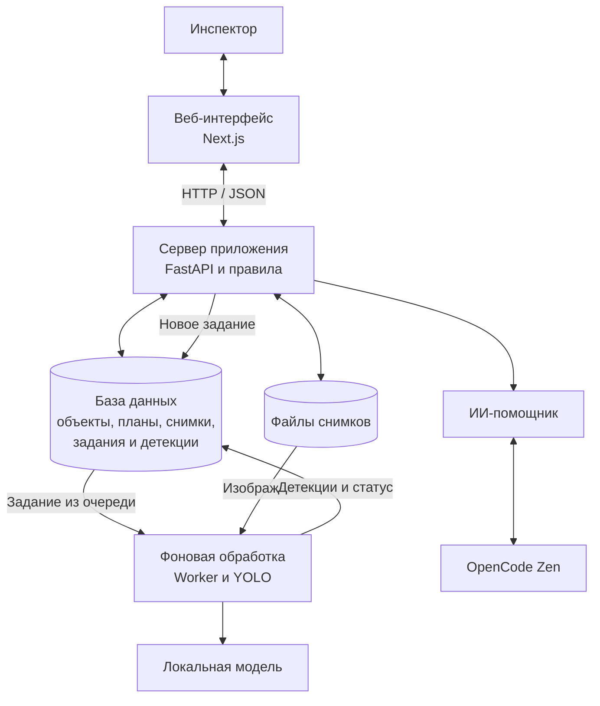

# BuildWatch — упрощённая архитектура

## Как проходит работа

- Интерфейс запрашивает через API данные объектов, планов и сигналов.
- При загрузке снимка API сохраняет файл и создаёт задание на детекцию.
- Фоновый worker забирает задание, запускает локальную YOLO-модель и записывает результат в базу. Правила приложения сопоставляют детекции с этапом плана, серией снимков и зонами кадра и формируют сигналы. Прогноз по графику и динамика считаются при чтении карточки.
- ИИ-помощник по запросу обращается к OpenCode Zen; предложения изменить план применяются после подтверждения пользователя.

Внешний ИИ-сервис нужен только помощнику. Детекция снимков выполняется локально.
