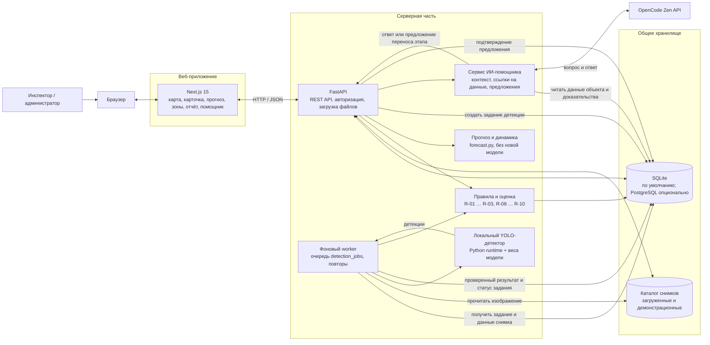

# Архитектура BuildWatch

Схема показывает текущую архитектуру прототипа: веб-интерфейс, API, хранилища и обработку снимков в фоне.

## Основные потоки

1. **Просмотр объекта.** Next.js запрашивает у FastAPI портфель или карточку объекта. API объединяет сведения об объекте, этапах плана, снимках, детекциях, зонах кадра и сигналах из базы. Прогноз, динамика за 30 дней и сводка вердиктов инспектора считаются при чтении и в базу не пишутся.
2. **Новый снимок.** API сохраняет файл в каталоге медиа, добавляет снимок и задание в SQLite. Worker забирает задание, запускает локальную модель, проверяет формат результата и записывает детекции и статус. Затем правила пересчитывают сигналы объекта, включая серию снимков и полигоны зон.
3. **ИИ-помощник.** Сервис формирует контекст из данных BuildWatch, включая прогноз, фразу динамики и сводку вердиктов, и отправляет вопрос в OpenCode Zen. Если предложен перенос дат, он сохраняется как ожидающее подтверждения предложение; применение требует отдельного подтверждённого запроса.

## Развёртывание

В Docker Compose запущены три сервиса: `frontend` (порт 8700), `api` (порт 8600) и `worker`. API и worker совместно используют базу данных и каталог медиа; worker также получает веса модели. При стандартной конфигурации база SQLite хранится в Docker volume. Backend поддерживает PostgreSQL через `BUILDWATCH_DATABASE_URL`; Compose по умолчанию его не поднимает.

Внешние зависимости: OpenCode Zen используется только для запросов ИИ-помощника. Детекция изображений выполняется локально в worker.
