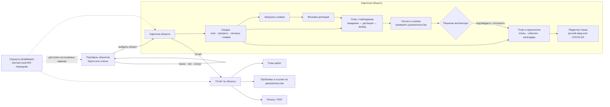
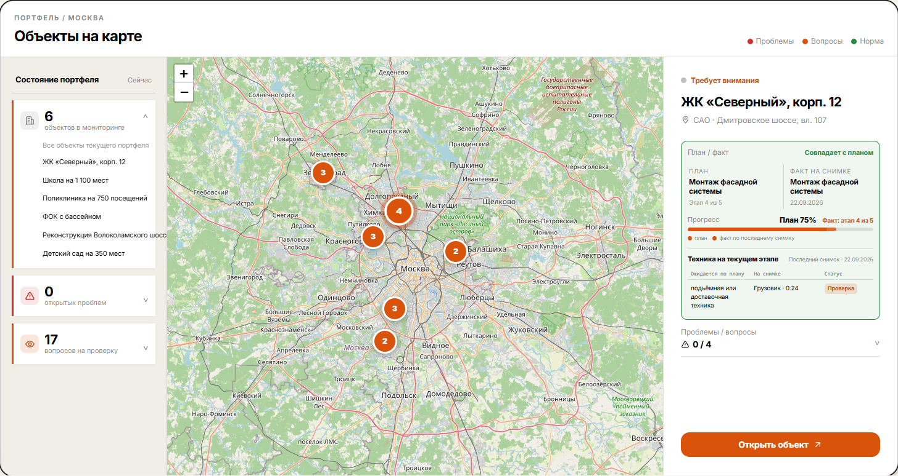
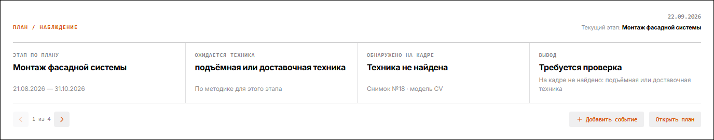
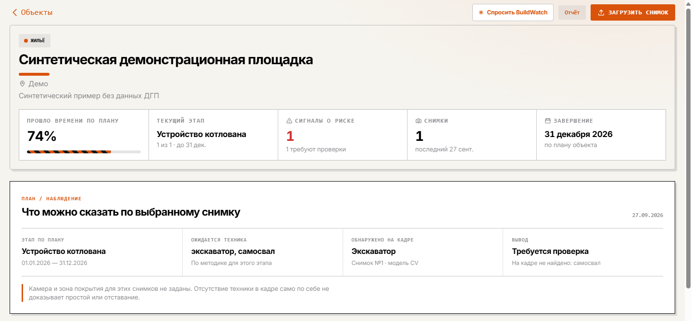
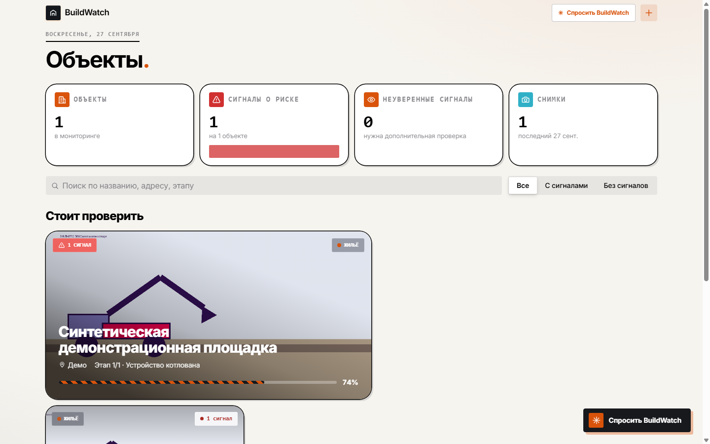

# UX-архитектура BuildWatch

Схема показывает основные экраны и путь инспектора от обзора портфеля до проверки сигнала и печатного отчёта.

## Разделы интерфейса

| Раздел | Назначение | Основное действие |
|---|---|---|
| Портфель | Географический и табличный обзор объектов, счётчики состояния, поиск и фильтры | Выбрать объект или сузить список |
| Карточка объекта | Текущий этап, календарный прогресс, сигналы, снимки и сведения о площадке | Открыть доказательство, добавить снимок или событие |
| План / наблюдение | Сравнение ожидаемого по этапу с тем, что распознано на выбранном снимке | Перейти к снимку и проверить сигнал |
| План и хронология | Этапы календарного плана и события инспектора, снимки, проблемы и вопросы | Отредактировать даты или добавить событие |
| Отчёт | Сводные показатели, календарный план и статусы проблем с переходами к доказательствам | Распечатать или сохранить PDF |
| Помощник BuildWatch | Ответы с контекстом проекта; перенос дат предлагается отдельно | Задать вопрос или рассмотреть предложение |

## Скриншоты разделов

Снимки с `live` в имени — сохранённые скриншоты рабочего интерфейса от 28 сентября 2026 года. Карта портфеля показывает демо-данные. Детальная карточка ниже — отдельный синтетический пример, а не снимок реального строительного объекта.

### Портфель: карта объектов

### Карточка объекта: сравнение плана и наблюдения

### Карточка объекта: сводка и раздел плана

### Портфель: список объектов и фильтры

## Границы интерпретации

Распознанный объект на снимке — основание для внимания, а не автоматическое заключение о ходе стройки. Отсутствие техники на одном кадре не доказывает простой или отставание. Вывод проверяет инспектор; отчёт хранит статусы решения и ссылки на снимки.

